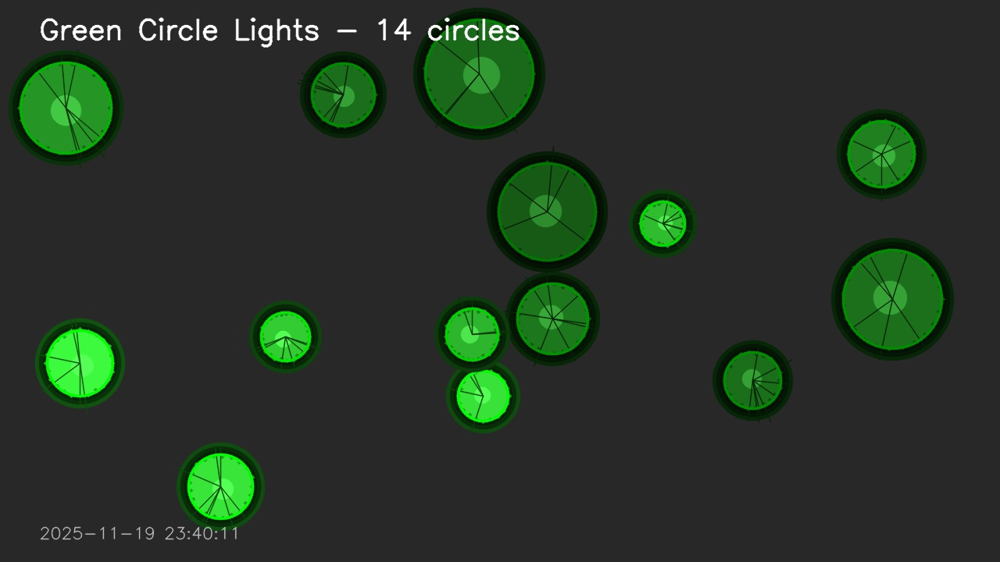
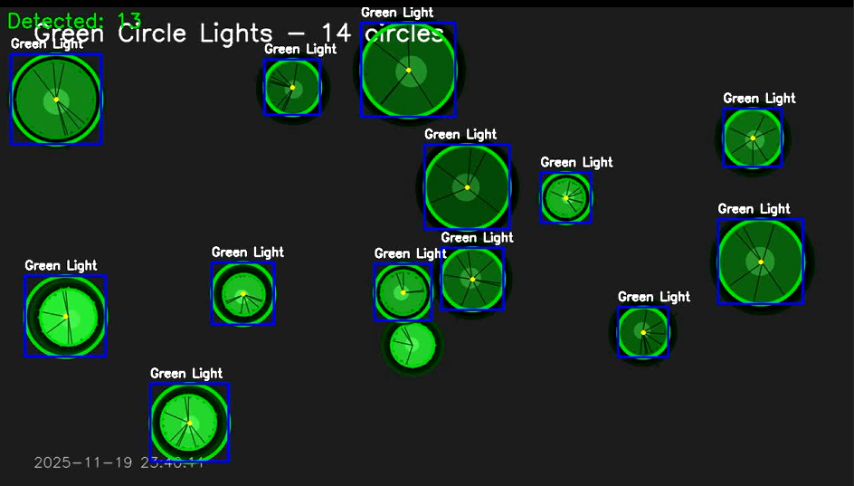

# 圆形绿色灯检测程序

使用OpenCV 4的C++程序，用于检测视频中的圆形绿色灯并框选出来。

## 功能特点

- 读取视频文件并逐帧处理
- 使用HSV色彩空间识别绿色对象
- 使用霍夫圆变换检测圆形
- 在检测到的绿色灯周围绘制圆形轮廓和矩形边界框
- 实时显示检测数量

## 编译要求

- C++11 或更高版本
- OpenCV 4.x
- CMake 3.10 或更高版本

## 编译步骤

```bash
# 创建构建目录
mkdir build
cd build

# 使用CMake生成构建文件
cmake ..

# 编译程序
make
```

## 使用方法

```bash
./detect_green_light <视频文件路径>
```

例如：
```bash
./detect_green_light ../test_video.mp4
```

## 程序说明

### 检测流程

1. **色彩空间转换**: 将BGR图像转换为HSV色彩空间
2. **颜色过滤**: 使用HSV范围过滤出绿色区域（H: 35-85, S: 40-255, V: 40-255）
3. **形态学处理**: 使用开运算和闭运算去除噪声
4. **圆形检测**: 使用霍夫圆变换识别圆形对象
5. **结果绘制**: 在原始图像上绘制检测结果

### 可调参数

在代码中可以调整以下参数以优化检测效果：

- **HSV颜色范围**: `lower_green1` 和 `upper_green1`
- **形态学核大小**: `Size(5, 5)`
- **霍夫圆变换参数**:
  - `minDist`: 圆心之间的最小距离
  - `param1`: Canny边缘检测的高阈值
  - `param2`: 累加器阈值
  - `minRadius` 和 `maxRadius`: 最小和最大半径

### 控制键

- **ESC** 或 **q**: 退出程序

## 输出

程序会显示两个窗口：
1. **原始视频**: 显示输入的原始视频帧
2. **检测结果**: 显示带有检测标记的视频帧
   - 绿色圆形轮廓表示检测到的圆形
   - 蓝色矩形框表示边界框
   - 黄色点表示圆心
   - 文字标签显示"Green Light"

## 注意事项

- 确保视频文件路径正确
- 根据实际光照条件和绿色灯的特征，可能需要调整HSV颜色范围
- 对于不同大小的绿色灯，需要调整霍夫圆变换的半径参数

## draw_green_circle

- draw random numbers of circle

## Evaluation
**Before detection:**
-

**After detection:**
-